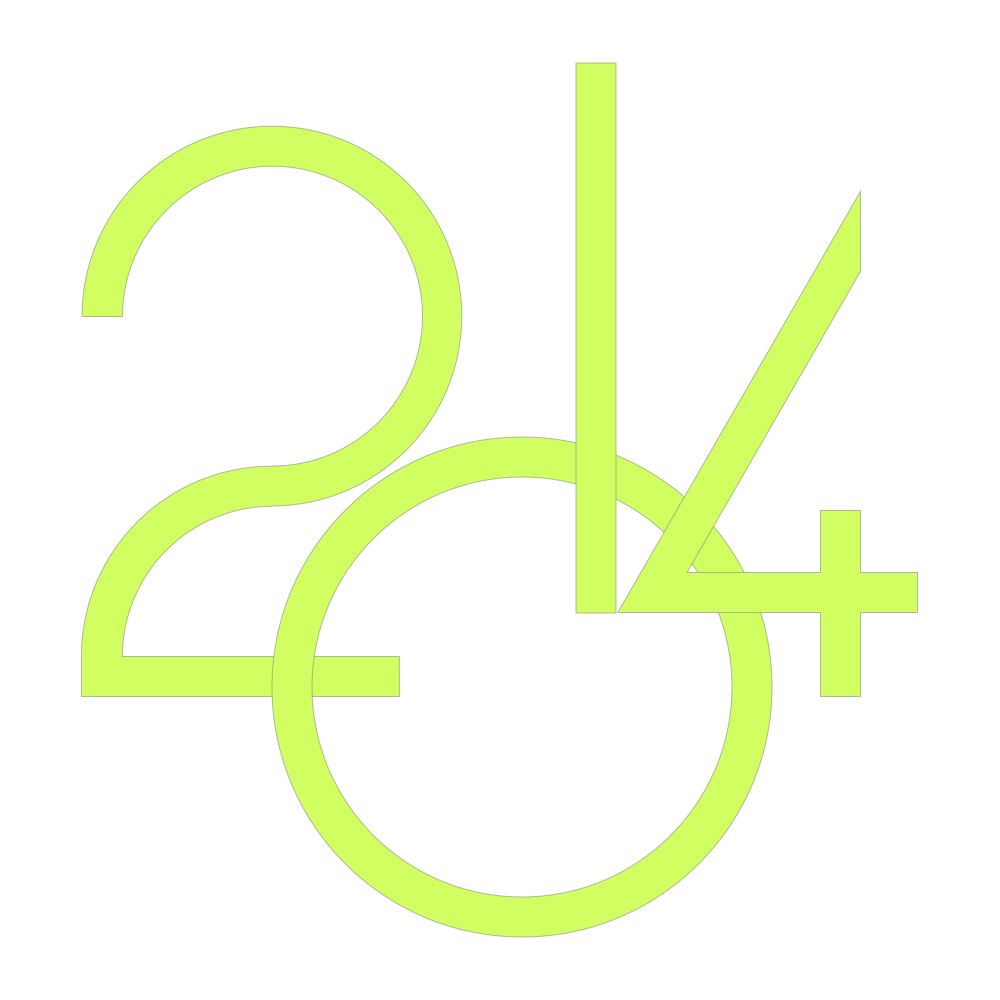

# Yearly Review

> Every year is a unique page of a book
===

## Year 2014
  Review that year...
  
  ->> [Review 2014](https://jack-q.github.com/yearly-review/2014/)
  
  
  
  
  > view of my 2014
  > > a simple year with 365 days, a complex year with all kinds of feelings
  >
  > it is a gallery of memory:
  > > discontinuous explicitly
  >
  > it is a set of keywords of trifles:
  > > negligible seemingly
  
---
 